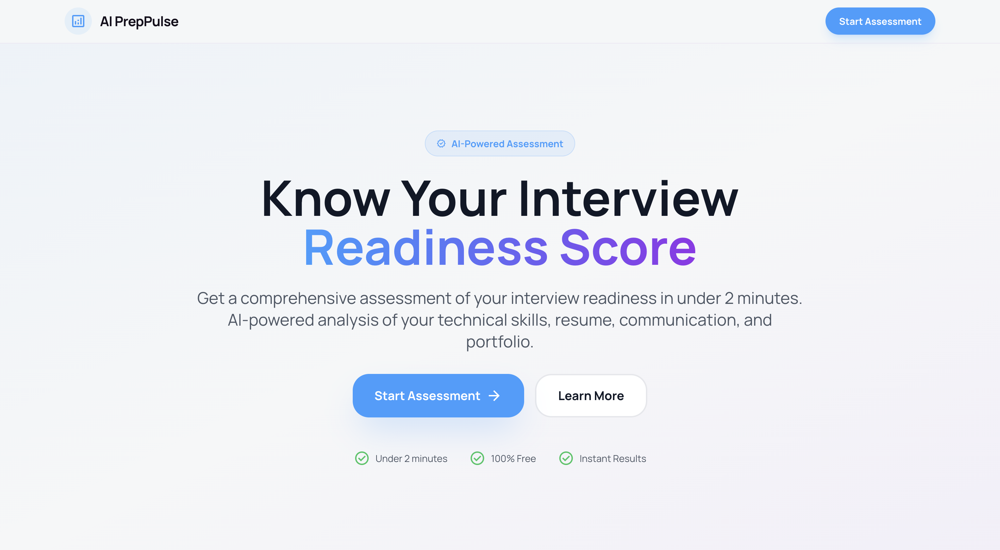
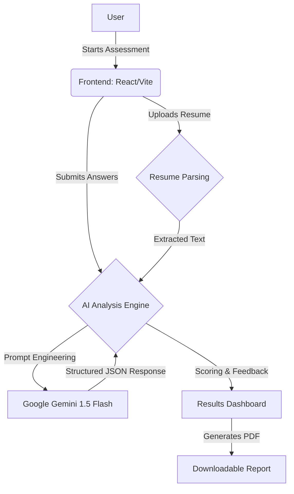
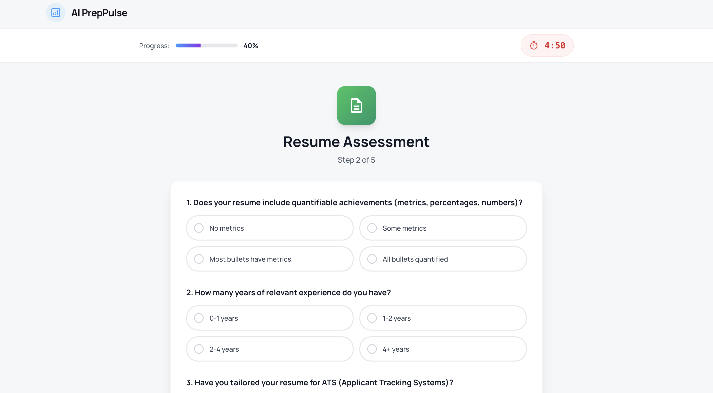
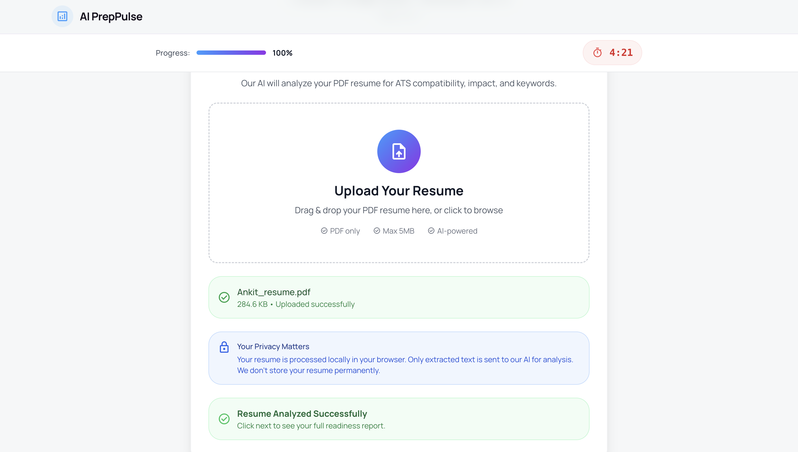
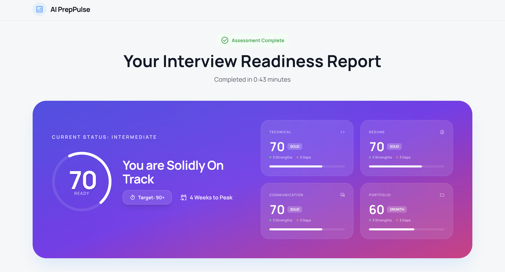
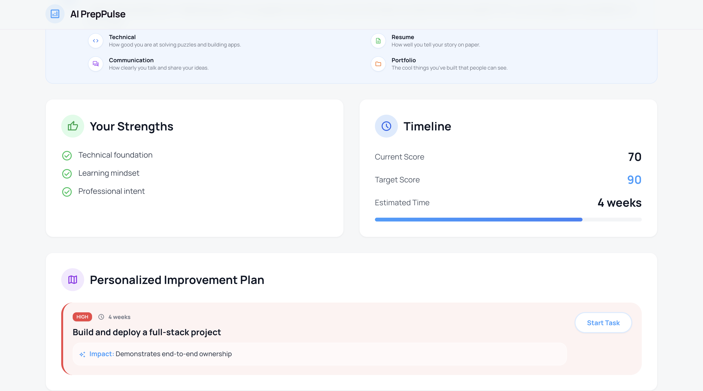
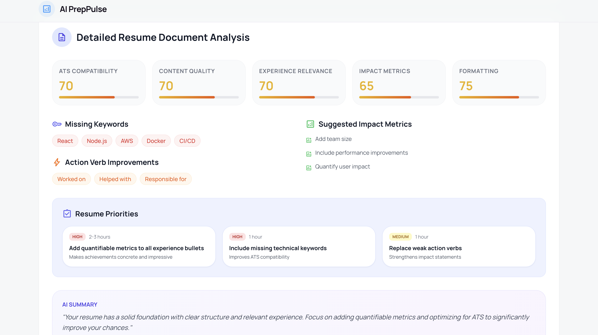
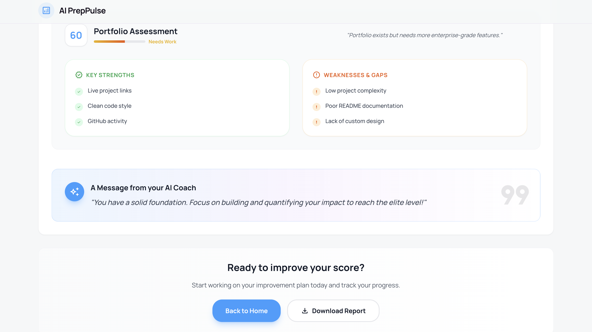

# 🚀 AI PrepPulse - Your Professional AI Interview Coach

<div align="center">
  
  <br><br>

  [](https://drive.google.com/file/d/1aSAxpOCjASWQKolKelXjZxMw6ISJSEBm/view?usp=sharing)
  [](https://opensource.org/licenses/MIT)
  [](https://reactjs.org/)
  [](https://vitejs.dev/)
  [](https://deepmind.google/technologies/gemini/)

  <h3>Assess. Analyze. Accelerate.</h3>
  <p>AI PrepPulse is an advanced, AI-powered platform designed to simulate high-stakes technical interviews and provide instant, professional-grade feedback.</p>
</div>

---

## 🏆 Project Overview (Impact & Innovation)

Finding a job in tech is harder than ever. Candidates struggle not just with coding, but with **communicating their value** and **optimizing their resume** for modern ATS systems.

**AI PrepPulse solves this by aggregating 4 critical pillars of interview readiness into a single, 10-minute assessment:**
1.  **Technical Proficiency**: Deep-dive coding and system design questions.
2.  **Resume Impact**: Structural and keyword analysis of the user's uploaded resume.
3.  **Communication**: Evaluation of clarity, structure, and conciseness.
4.  **Portfolio Quality**: Assessment of project descriptions and demonstrable work.

**Why it's different:**
Unlike generic coding platforms, AI PrepPulse acts as a **holistic career coach**, using Google's Gemini 1.5 Flash to generate a **startup-specific readiness score** and a detailed, prioritized roadmap for improvement.

---

## 🏗️ Architecture & Flow



---

## ✨ Key Features (User Experience)

### 1. 🧠 Consolidated AI Analysis
We use a sophisticated, multi-stage prompting strategy to analyze the candidate's Resume, Technical Answers, and Behavioral responses in one go. This ensures the feedback is **context-aware**—identifying gaps between what a candidate *says* they know and what their resume *shows*.

<div align="center">
  
  
</div>

### 2. 📊 Professional Results Dashboard
Gone are the complex, developer-centric metrics. Our dashboard is designed for **clarity and motivation**:
-   **Readiness Score**: A clear 0-100 metric with status levels (Elite, Solid, Growth).
-   **Visual Breakdowns**: Glassmorphism-styled charts and progress rings.
-   **Plain English Explanations**: "What does this score mean?" sections for accessibility.

<div align="center">
  
  
</div>
<br>
<div align="center">
  
</div>
<br>
<div align="center">
  
</div>

### 3. 📄 Instant PDF Report Generation
Users can download a **professional, print-ready PDF report** of their assessment.
-   **Theory & Methodology**: Explains how the score was calculated.
-   **Executive Summary**: High-level insights for quick reading.
-   **Visuals**: Simplified charts optimized for print (A4 format).
-   *Powered by `html2pdf.js` with a custom, hidden rendering engine.*


---

## 🛠️ Technical Execution

### Tech Stack
| Component | Technology |
| :--- | :--- |
| **Frontend** | React (Vite), Tailwind CSS |
| **AI Engine** | Google Gemini API (`gemini-1.5-flash`) |
| **State Management** | React Context API |
| **PDF Generation** | `html2pdf.js` |
| **Parsing** | `pdfjs-dist` (Resume Parsing) |

### Code Quality Highlights
-   **Modular Architecture**: Separated concerns for API Services, Context, and UI Components.
-   **Robust Error Handling**: "Graceful degradation" logic ensures the app provides value even if the AI service experiences partial outages.
-   **Responsive Design**: Fully optimized for Desktop, Tablet, and Mobile.

---

## 🚀 Getting Started

1.  **Clone the repository**
    ```bash
    git clone https://github.com/yourusername/ai-preppulse.git
    cd ai-preppulse
    ```

2.  **Install dependencies**
    ```bash
    npm install
    ```

3.  **Set up Environment Variables**
    Create a `.env` file in the root directory and add your Google Gemini API key:
    ```bash
    VITE_GEMINI_API_KEY=your_api_key_here
    ```

4.  **Run the development server**
    ```bash
    npm run dev
    ```

5.  **Open in Browser**
    Navigate to `http://localhost:5173` (or the port shown in your terminal).

---

## 👥 Team
-   **Ankit** - Full Stack Developer & AI Engineer

---

*Built with ❤️ for the Hackathon 2026.*
